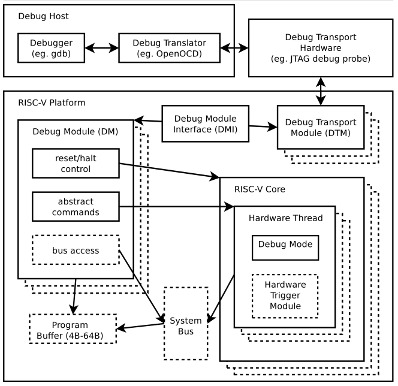
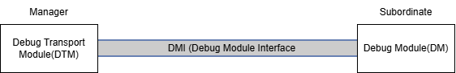
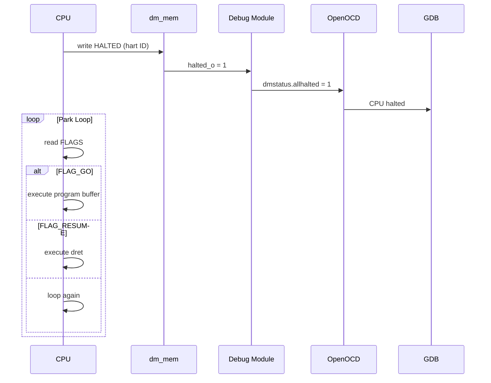
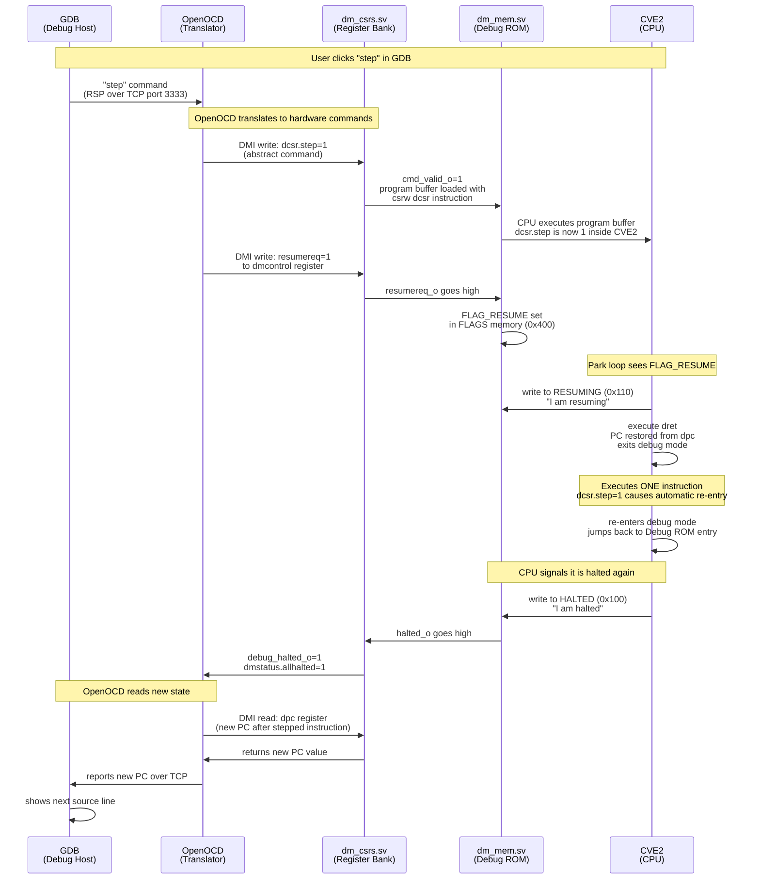

# RISC-V Soft Core Debug Tutorial

## Table of Contents

1. [Introduction](#introduction)
2. [The Two Types of Debug Implementation](#the-two-types-of-debug-implementation)
3. [System-Level Debug Infrastructure](#system-level-debug-infrastructure)
4. [CVE2: Execution-Based Debug in Practice](#cve2-execution-based-debug-in-practice)
5. [The riscv-dbg Reference Implementation](#the-riscv-dbg-reference-implementation)
6. [Debug Host Software](#debug-host-software)
7. [End-to-End Debug Flow](#end-to-end-debug-flow)
8. [What the DDCA CPU Would Need](#what-the-ddca-cpu-would-need)
9. [References](#references)

---

# Introduction

> This tutorial explains the complete hardware and software debug chain for a RISC-V soft core, from GDB down to the CPU signals, using the [CV32E20 RISC-V Core](https://github.com/openhwgroup/cve2/tree/main) as a reference. A separate section covers what a simpler educational CPU like the DDCA core would need to support the debug infrastructure.

---
## Why Do We Need a CPU Debugger?

Modern CPUs execute millions of instructions per second. Without a debugger, finding bugs would be nearly impossible since the CPU moves far too fast for a developer to observe what is happening. A debugger solves this by allowing you to:

- Set breakpoints to pause execution at a specific instruction
- Execute instructions one at a time
- Inspect memory and register values at any point

## The Three Layers of Debugging

In order to enable debug functionality for a CPU you need three layers working together:

- **Debug Host** — the software running on your laptop such as GDB and OpenOCD
- **Debug Transport Hardware** — the physical connection between your laptop and your chip such as a USB Blaster cable
- **On-Chip Debug Hardware** — the logic inside your CPU and surrounding it that allows external tools to control it

It is worth mentioning that debug support in the core is only one of the components needed to build a System on Chip design with run-control debug support. Additionally, a Debug Module and a Debug Transport Module, compliant with the [RISC-V Debug Specifications](https://github.com/riscv/riscv-debug-spec/releases), are needed.

The diagram below, referenced from the RISC-V External Debug Support Specification, shows all three layers and how they interconnect. Each layer will be explored in detail in the following sections.



*Figure 1: RISC-V Debug System Overview — RISC-V External Debug Support Specification v1.0.*

---
## Tutorial Scope

This tutorial covers:

- The architecture of run-control debug (halt, resume, single-step, register/memory access)
- The roles of the Debug Module, Debug Transport Module, and Debug Module Interface
- How GDB and OpenOCD connect to a RISC-V soft core
- What a simple educational CPU would need to add to support debug

_This tutorial does not cover:_

- Step-by-step FPGA implementation
- Hardware triggers and breakpoints in depth (only briefly mentioned)

_Reference implementation: CVE2 core + riscv-dbg debug module._

---

# The Two Types of Debug Implementation

According to the RISC-V Debug Specifications there are two main ways of enabling debug capability on a RISC-V core.

## Abstract Command Based

In this form of debugging, the CPU is halted by stalling its execution pipeline.

The debugger accesses CSRs and GPRs through a multiplexer (mux) on the register file, controlled by the Access Register abstract command. This allows the Debug Module (DM) to read and write registers directly, bypassing the normal CPU datapath.

Memory can be accessed in two ways:

- **Abstract Memory Commands** — where the CPU assists in performing the access
- **System Bus Access** — where the Debug Module directly issues read/write transactions onto the system interconnect (bus), bypassing the CPU entirely

The abstract commands (for both register and memory access) control the muxing logic that routes the DM's read/write operations into the CPU's internal structures instead of the standard execution path.

Because of this design, the CPU does not need to execute any instructions for the debugger to inspect or modify its state. This makes abstract command–based debugging robust, even if the CPU is fully stalled or has crashed.

## Execution Based

In execution-based debugging, instead of directly accessing internal state through hardware muxes, the Debug Module (DM) leverages the CPU itself to perform operations. It does this by writing small instruction sequences into a Program Buffer, which the CPU then executes.

This is the path CVE2 takes, and it is the path this tutorial focuses on for the rest of the document.

---

# System-Level Debug Infrastructure

In order to enable run-control debug for an arbitrary soft-core processor, you need to add the following modules in addition to CPU-level logic.

## Debug Module (DM)

The Debug Module is the bridge between abstract debug commands and their specific implementation.

According to the *RISC-V External Debug Support Specification v1.0*, the Debug Module's key responsibilities are:

- **Hart Control**
    - Halt and resume execution via `debug_req_i`
- **Status Reporting**
    - Track which harts are halted and expose this through debug registers
- **Register and Memory Access**
    - Provide access to CPU state (e.g., GPRs, `dpc`, `dcsr`)
    - In execution-based debug, this is done by executing instructions from the program buffer
- **Debug Entry Control**
    - Provide addresses such as `dm_halt_addr_i` for entering debug mode
- **System Integration**
    - Interface with the Debug Transport Module (DTM) via the Debug Module Interface (DMI)

## Debug Module Interface (DMI)

The Debug Module Interface (DMI) is a simple master-slave protocol used to communicate between the Debug Transport Module (DTM) and the Debug Module (DM).

At its simplest, DMI can be implemented as a direct connection between a single manager (DTM) and a single subordinate (DM).

In more complex systems, DMI transactions may be transported over an existing system interconnect such as TileLink protocol or AMBA Advanced Peripheral Bus.

## Debug Transport Module (DTM)

The Debug Transport Module (DTM) is responsible for interfacing with external debug tools (e.g., via JTAG) and issuing DMI requests to the Debug Module. It issues requests to the Debug Module and returns responses back to the debugger.



*Figure 2: The DTM issues DMI requests to the Debug Module, which processes them and returns a response.*

---

# CVE2: Execution-Based Debug in Practice

To understand how run-control debug operates in practice, we examine the CV32E20 core, which implements execution-based debug as defined in the RISC-V Debug Specification.

[CVE2](https://github.com/openhwgroup/cve2) is a production-grade 32-bit RISC-V core. It is a fork of [Ibex](https://github.com/lowRISC/ibex) by lowRISC and already has run-control debug support built in, using the execution-based path (Appendix A.2 of the spec).

To enable debug support in CVE2, two main components are required:

1. **Core Debug Support**
   - Interface signals between the CPU and the Debug Module (DM)
   - Core debug CSRs (e.g., `dcsr`, `dpc`, `dscratch0/1`)
2. **System-Level Debug Infrastructure**
   - Debug Module (DM)
   - Debug Transport Module (DTM)

## Interface Signals Between the CPU and the Debug Module (DM)

The following signals define the interface between the Debug Module (DM) and the CPU:

| Signal                | Description                                                                    | Notes                                                                           |
| --------------------- | ------------------------------------------------------------------------------ | ------------------------------------------------------------------------------- |
| `debug_req_i`         | Request to enter Debug Mode                                                    | Asserted by the Debug Module to halt the CPU (acts like a debug interrupt).     |
| `debug_halted_o`      | Asserted if core enters Debug Mode                                             | Indicates to the DM that the CPU has successfully halted.                       |
| `dm_halt_addr_i`      | Address to jump to when entering Debug Mode (default 0x1A110800)               | Typically points to the debug ROM / park loop entry.                            |
| `dm_exception_addr_i` | Address to jump to when an exception occurs in Debug Mode (default 0x1A110808) | Used if an exception happens while executing debug code (e.g., program buffer). |

## Debug-Specific Registers

The full CVE2 register bank can be found here: [`rtl/cve2_cs_registers.sv`](https://github.com/openhwgroup/cve2/blob/main/rtl/cve2_cs_registers.sv).

For the purposes of this tutorial, we only need to focus on the **debug-specific registers**: `dcsr`, `dpc`, `dscratch0`, and `dscratch1`. These Core Debug Registers must be implemented for each hart that can be debugged.

### `dpc` (Debug Program Counter)

Upon entering Debug Mode, the `dpc` register is updated with the address of the next instruction that would have been executed.

This value is used to resume normal execution when the CPU exits Debug Mode. When a `dret` (debug return) instruction is executed, the CPU restores the program counter from `dpc` and continues execution from that point.

### `dcsr` (Debug Control and Status Register)

The `dcsr` register stores control and status information for Debug Mode. It records the reason the CPU entered Debug Mode (e.g., external debug request, breakpoint, or single-step) and provides control over debug behavior, such as enabling single-stepping and handling breakpoints.

### `dscratch0` / `dscratch1`

The `dscratch` registers are reserved for use by the CPU or debug implementation. Their usage is implementation-specific.

A debugger must not use these registers unless explicitly permitted by the Debug Module (DM), typically indicated through the `hartinfo` register.

## Debug Entry Behavior

When the Debug Module (DM) asserts `debug_req_i`, the CPU transitions into Debug Mode.

From analysis of the [CVE2 controller RTL](https://github.com/openhwgroup/cve2/blob/main/rtl/cve2_controller.sv), the behavior can be summarized as:

1. The CPU completes the current instruction.
2. The current program counter is saved into `dpc`.
3. Debug Mode is entered (`dcsr` is updated).
4. Execution is redirected to `dm_halt_addr_i`.
5. The pipeline is flushed to ensure a clean transition.

Once halted, the Debug Module can execute instructions on the CPU using the Program Buffer.

## The Debug Mode Access Guard

All debug-specific CSRs must be guarded against access by external software. The RISC-V Debug Specification mandates this — these registers are only accessible from Debug Mode.

In CVE2 this is implemented with a single line inside the CSR read logic:

```systemverilog
CSR_DCSR: begin
    csr_rdata_int = dcsr_q;
    illegal_csr = ~debug_mode_i;  // ← THE GUARD
end
```

This feeds into:

```systemverilog
assign illegal_csr_insn_o = csr_access_i & (illegal_csr | illegal_csr_write | illegal_csr_priv);
```

The same guard pattern is applied identically to all four debug CSRs:

| Register        | Guard condition               |
| --------------- | ----------------------------- |
| `CSR_DCSR`      | `illegal_csr = ~debug_mode_i` |
| `CSR_DPC`       | `illegal_csr = ~debug_mode_i` |
| `CSR_DSCRATCH0` | `illegal_csr = ~debug_mode_i` |
| `CSR_DSCRATCH1` | `illegal_csr = ~debug_mode_i` |

---

# Debug Host Software

## GDB (GNU Debugger)

GDB (GNU Debugger) is the standard debugging tool used in Linux and embedded systems development. It is the primary interface that a developer interacts with when debugging a program.

GDB allows you to:

- Run and stop programs
- Set breakpoints (e.g., "stop at line 42")
- Step through execution one instruction at a time
- Inspect variables and memory
- View and modify register values

In short, GDB provides a high-level, software view of program execution.

## Why OpenOCD is Needed

GDB communicates using the Remote Serial Protocol (RSP), which sends text-based commands over a TCP connection.

However, the DTM (Debug Transport Module) does not understand RSP. It operates using JTAG signals.

These two interfaces are fundamentally incompatible:

- GDB speaks software-level commands
- Hardware expects low-level signal and register operations

This is where OpenOCD comes in.

## The Role of OpenOCD

OpenOCD acts as a translator between GDB and hardware. It sits between the two systems and converts high-level debug commands into JTAG pulses.

## Why Use the RISC-V Fork of OpenOCD?

The [riscv-collab/riscv-openocd](https://github.com/riscv-collab/riscv-openocd) fork has better support for the RISC-V debug spec — full implementation of DMI, abstract commands, and Program Buffer flows. This is what BoxLambda and most RISC-V soft-core projects use.

## OpenOCD Configuration Files

OpenOCD always uses two configuration files.

### 1. Interface Config

- Not RISC-V specific
- Describes the physical connection between your computer and the target
- Depends on your setup

Common examples:

- USB Blaster / FTDI → real FPGA hardware
- `remote_bitbang` → simulation (e.g., Verilator)

A real example (simulation interface config) can be found in the BoxLambda project: [verilator.openocd.cfg](https://github.com/epsilon537/boxlambda/blob/master/scripts/verilator.openocd.cfg).

This configuration uses:

```
adapter driver remote_bitbang
remote_bitbang host localhost
remote_bitbang port 9999
```

### 2. Target Config

- **RISC-V specific**
- Describes the system you are debugging

It defines:

- The core type (e.g., Ibex / CVE2)
- JTAG chain parameters (e.g., IR length)
- Debug interface behavior (DMI, program buffer, memory access)

BoxLambda provides a working example of a RISC-V debug configuration: [verilator.openocd.cfg](https://github.com/epsilon537/boxlambda/blob/master/scripts/verilator.openocd.cfg).

Note that BoxLambda uses one combined config file (`verilator.openocd.cfg`) that includes both interface setup and target setup, but conceptually OpenOCD still treats these as **two logical parts**.

Here is how you run them:

```bash
openocd -f interface/usb-blaster.cfg \
        -f target/cve2_de1soc.cfg
```

## Simulation vs Real FPGA

The adapter section is the only thing that changes between simulation and real FPGA setups. Everything else is identical, because riscv-dbg looks the same to OpenOCD either way.

## The BoxLambda Reference

[BoxLambda](https://github.com/epsilon537/boxlambda) is a proven working example. It connects riscv-dbg to Ibex (which CVE2 forks from), and its config files are the basis for most of this tutorial.

## FPGA Implementation: Virtual JTAG

If the soft-core processor is to be run on a physical FPGA, we must note that FPGAs only have one physical JTAG port, but it must serve multiple purposes:

1. FPGA programming (Quartus)
2. CPU debug (riscv-dbg)

This is solved using **Virtual JTAG** (IP) provided by Quartus:

```
Physical JTAG
      |
  Virtual JTAG IP
     /     \
Quartus   riscv-dbg
```

Instead of directly driving the physical JTAG pins, the Debug Transport Module (DTM) connects to this internal interface. This allows both programming and debug to use the same physical JTAG connection without conflict.

---

# The riscv-dbg Reference Implementation

[pulp-platform/riscv-dbg](https://github.com/pulp-platform/riscv-dbg) is the reference Debug Module + Debug Transport Module implementation used by most open-source RISC-V soft cores. It implements the RISC-V debug spec and is compatible with CVE2 because CVE2 is a fork of Ibex, and Ibex officially uses riscv-dbg.

This section walks through how the reference Debug Module is structured and how it talks to CVE2.

## How the Debug Module Accesses Memory

In execution-based debug, the DM does not access CPU state directly. Instead it executes real instructions on the CPU:

1. CPU enters debug → jumps to debug ROM
2. Debug ROM runs the park loop
3. Debugger writes instructions into the Program Buffer
4. Debug ROM jumps to the Program Buffer
5. CPU executes those instructions
6. CPU returns to the debug ROM

The Program Buffer in this implementation lives inside the Debug Module ([`dm_mem.sv`](https://github.com/pulp-platform/riscv-dbg/blob/master/src/dm_mem.sv)) and is accessed using a range of dedicated addresses.

## `dm_csrs.sv` — The DMI Register Bank

[`dm_csrs.sv`](https://github.com/pulp-platform/riscv-dbg/blob/master/src/dm_csrs.sv) is the DMI register bank that OpenOCD writes into. It receives halt/resume commands from OpenOCD over DMI, stores them in registers, and outputs them as signals to `dm_mem.sv`.

```systemverilog
// When OpenOCD writes haltreq=1 to dmcontrol over DMI
dm::DMControl: begin
    dmcontrol_d = dmi_req_i.data;
end

// Stored on next clock edge
always_ff @(posedge clk_i or negedge rst_ni) begin
    dmcontrol_q <= dmcontrol_d;
end
```

```systemverilog
// Combinational output multiplexer
haltreq_o[selected_hart] = dmcontrol_q.haltreq;
```

Once stored, `dmcontrol_q.haltreq` immediately drives `haltreq_o` high. This signal travels to `dm_mem.sv`, which drives `debug_req_o` to CVE2.

### Why the `dmcontrol_d = dmi_req_i.data` assignment works

This is one of the cleverest patterns in the riscv-dbg codebase. The package `dm_pkg.sv` defines `dmcontrol_t` as a packed struct that maps exactly to the `dmcontrol` register layout in the RISC-V Debug Spec (Section 3.12.2):

```systemverilog
typedef struct packed {
    logic        haltreq;        // bit 31
    logic        resumereq;      // bit 30
    logic        hartreset;      // bit 29
    logic        ackhavereset;   // bit 28
    logic        zero1;          // bit 27
    logic        hasel;          // bit 26
    logic [9:0]  hartsello;      // bits 25:16
    logic [9:0]  hartselhi;      // bits 15:6
    logic [1:0]  zero0;          // bits 5:4
    logic        setresethaltreq;// bit 3
    logic        clrresethaltreq;// bit 2
    logic        ndmreset;       // bit 1
    logic        dmactive;       // bit 0
} dmcontrol_t;
```

When OpenOCD writes 32 bits to the `dmcontrol` address over DMI, the assignment `dmcontrol_d = dmi_req_i.data` automatically maps each bit into the correct named field, because the struct is packed (bits are laid out sequentially, exactly matching the spec).

> syntax: when you see `dm::dmcontrol_t` in the source, the `::` is SystemVerilog's package scope operator. `dm` is the package name (defined in `dm_pkg.sv`); `dmcontrol_t` is the type defined inside it. Think of it like a C/C++ header file shared across modules.

## `dm_mem.sv` — Memory-Mapped Bridge to CVE2

[`dm_mem.sv`](https://github.com/pulp-platform/riscv-dbg/blob/master/src/dm_mem.sv) receives the request from `dm_csrs.sv` and drives the actual `debug_req_o` signal to CVE2:

```systemverilog
// debug_req_o driven by haltreq
// dm_mem drives this signal to CVE2
assign debug_req_o = haltreq_i;
```

When the CVE2 park loop writes to HaltedAddr dm_mem detects this write and reports back to OpenOCD.

```systemverilog
// CPU signals it is halted
if (req_i && addr_i == HaltedAddr) begin
    halted_o[hart] = 1'b1;
end
```


## The Debug ROM and Park Loop

When CVE2 enters Debug Mode, it jumps to `dm_halt_addr_i`. This address points to a small piece of assembly code called the Debug ROM, implemented in [`debug_rom/debug_rom.S`](https://github.com/pulp-platform/riscv-dbg/blob/master/debug_rom/debug_rom.S) inside riscv-dbg.

### Memory-Mapped Communication

The CPU and Debug Module communicate through four memory-mapped addresses:

```
Address 0x100 (HALTED)    CPU writes here to say "I am halted"
Address 0x108 (GOING)     CPU writes here to say "I saw your GO flag"
Address 0x110 (RESUMING)  CPU writes here to say "I am resuming"
Address 0x118 (EXCEPTION) CPU writes here to say "something went wrong"
```

And one flag region:

```
Address 0x400 (FLAGS)     DM writes here to command the CPU
                          FLAG_GO     = execute program buffer
                          FLAG_RESUME = resume normal execution
```

This is the key insight of execution-based debug: the DM and the CPU communicate through shared memory, not through message passing.

### Entry — First Halt

When `debug_req_i` is asserted, CVE2 jumps to the Debug ROM entry point. The `fence` instruction ensures all previous memory operations are complete before debug begins.

```asm
_entry:
    fence
    csrw CSR_DSCRATCH0, s0
```

### The Park Loop — Waiting for Commands

After entry, the CPU falls into the park loop:

```asm
entry_loop:
    csrr s0, CSR_MHARTID
    sw   s0, HALTED(zero)     // Tell DM: "I am halted"

    lbu  s0, FLAGS(s0)        // Read flag byte
    andi s0, s0, (1 << FLAG_GO)
    bnez s0, going            // If GO flag set jump to going

    lbu  s0, FLAGS(s0)        // Read flag byte again
    andi s0, s0, (1 << FLAG_RESUME)
    bnez s0, resume           // If RESUME flag set jump to resume

    jal  zero, entry_loop     // Otherwise loop back and check again
```

### Park Loop Diagram



### The `whereto` Mechanism

When `FLAG_GO` is set the CPU jumps here:

```asm
going:
    sw zero, GOING(zero)      // Tell DM: "I saw your GO flag"
    csrr s0, CSR_DSCRATCH0    // Restore s0
    jal zero, whereto         // Jump to whereto
```

and then jumps to `whereto`:

```asm
whereto:
    nop
    // This nop gets overwritten at runtime
    // by the DM with a jump instruction
```

`whereto` starts as a `nop`, but the DM overwrites it at runtime with a jump to either:

- The abstract command handler (for GP register or memory access), or
- The program buffer (for arbitrary instruction execution)

This is how the DM controls what the CPU does next without the CPU needing to know which operation was requested. This is the core idea behind execution-based debug.

### Returning to Normal Execution

When `FLAG_RESUME` is set:

```asm
_resume:
    sw   s0, RESUMING(zero)   // Tell DM: "I am resuming"
    csrr s0, CSR_DSCRATCH0    // Restore s0
    dret                      // Return from debug mode
```


`dret` is a special RISC-V instruction that restores the PC from `dpc` (one of the four debug-specific CSRs) and exits debug mode. The CPU picks up exactly where it left off before being halted.

---

# End-to-End Debug Flow

Putting it all together, here is what happens when the user clicks step in GDB:

```
1. GDB sends step command to OpenOCD
   over TCP socket port 3333

2. OpenOCD writes dcsr.step=1
   using abstract command over DMI

3. OpenOCD writes resumereq=1
   to dmcontrol over DMI

4. dm_csrs.sv stores resumereq=1
   drives resumereq_o high

5. dm_mem.sv sees resumereq
   sets FLAG_RESUME in FLAGS memory

6. CVE2 park loop reads FLAGS
   sees FLAG_RESUME is set
   jumps to _resume

7. CPU executes dret
   PC restored from dpc
   dcsr.step=1 causes CPU to execute
   exactly ONE instruction
   then re-enter debug mode automatically

8. CPU re-enters debug mode
   jumps back to Debug ROM entry
   writes to HALTED address

9. dm_mem.sv sees HALTED write
   drives debug_halted_o high

10. DM reads new dpc value
    which is PC after the one instruction

11. OpenOCD reads dpc
    reports new PC back to GDB

12. GDB shows you the next source line
```

## Sequence Diagram



> **Note:** The step behavior is implemented entirely inside CVE2 via the `dcsr.step` bit. The Debug Module simply sets this bit and issues a resume. The CPU handles the rest itself, re-entering Debug Mode automatically after executing one instruction. This is the key advantage of execution-based debug: complex debug behaviors are delegated to the CPU, requiring minimal logic in the DM.

---

# What the DDCA CPU Would Need

The DDCA CPU is the single-cycle RISC-V design from Section 7.6 of Harris and Harris's *Digital Design and Computer Architecture*. It supports a subset of RV32I (`lw`, `sw`, `add`, `sub`, `and`, `or`, `slt`, `addi`, `andi`, `ori`, `slti`, `beq`, `jal`).

This section walks through the minimum changes needed to make the DDCA core debuggable with the same riscv-dbg + OpenOCD + GDB stack described above.

## What the DDCA Core Currently Has

The top level module instantiates a single `riscvsingle` module wired to instruction memory and data memory:

```systemverilog
module top(input  logic        clk, reset,
           output logic [31:0] WriteData, DataAdr,
           output logic        MemWrite);
    logic [31:0] PC, Instr, ReadData;

    riscvsingle rvsingle(clk, reset, PC, Instr, MemWrite,
                         DataAdr, WriteData, ReadData);
    imem        imem(PC, Instr);
    dmem        dmem(clk, MemWrite, DataAdr, WriteData, ReadData);
endmodule
```

Inside `riscvsingle` the `controller` decodes the opcode into ALU-control, register-write, branch and memory signals, and the `datapath` advances the program counter through a 2-input PC mux:

```systemverilog
mux2 #(32) pcmux(PCPlus4, PCTarget, PCSrc, PCNext);
```

The DDCA core has no built-in debug infrastructure and is not pipelined. As a result, we do not need to handle pipeline flushing when entering debug mode. Additionally, features such as single-step execution are simpler to implement, since each instruction completes in a single clock cycle. This eliminates the need for additional control logic to manage partially executed instructions or maintain pipeline correctness.

## What the DDCA Core Is Missing for Debug

Compared to CVE2, the DDCA core is missing five things:

1. **The four debug interface signals** that connect the CPU to the Debug Module (`debug_req_i`, `debug_halted_o`, `dm_halt_addr_i`, `dm_exception_addr_i`).
2. **Debug CSRs** — `dcsr`, `dpc`, `dscratch0`, `dscratch1`.
3. **CSR instructions** — `csrrw`, `csrrs`, `csrrc`.

We need these three instructions at a minimum. They are standard RISC-V CSR instructions that allow the CPU to read and modify debug state.

- **`csrrw`** — read and write
- **`csrrs`** — set bits
- **`csrrc`** — clear bits

The Debug ROM uses these to read `dpc`, modify `dcsr`, and store temporary values. Without CSR instructions, it cannot function.

4. **`ebreak` and `dret`**

- **`ebreak`**: used by the Debug ROM to signal it is done → CPU returns to the park loop
- **`dret`**: exits debug mode → resumes execution from `dpc`

5. **A debug-mode flip-flop**

A 1-bit register that tracks whether the CPU is in debug mode.

- `1` → execute Debug ROM
- `0` → execute normal program

### DM Interface Signals

The `riscvsingle` module needs four new ports so the Debug Module can request a halt, observe the halted state, and tell the core where the Debug ROM lives in memory:

```systemverilog
module riscvsingle(input  logic        clk, reset,
                   // existing ports
                   output logic [31:0] PC,
                   input  logic [31:0] Instr,
                   output logic        MemWrite,
                   output logic [31:0] ALUResult, WriteData,
                   input  logic [31:0] ReadData,
                   // new debug ports
                   input  logic        debug_req_i,
                   output logic        debug_halted_o,
                   input  logic [31:0] dm_halt_addr_i,
                   input  logic [31:0] dm_exception_addr_i);
```

The way these four signals interact is the same handshake described in the CVE2 section above:

- `debug_req_i` acts like a debug-only interrupt. The DM raises it when OpenOCD writes `haltreq=1` into `dmcontrol`.
- The CPU sees `debug_req_i`, finishes its current instruction, saves the PC into `dpc`, sets the debug-mode flip-flop, and on the next cycle redirects fetch to `dm_halt_addr_i`.
- Once the CPU is fetching from the Debug ROM it asserts `debug_halted_o`, which the DM exposes back to OpenOCD as `dmstatus.allhalted`.
- `dm_exception_addr_i` is only used if something goes wrong while the CPU is already in debug mode (for example a fault inside the Program Buffer). DDCA has no exception infrastructure, so for our minimal implementation this port is wired but never triggered.

In summary, three of these signals (`debug_req_i`, `dm_halt_addr_i`, `debug_halted_o`) handle the normal halt handshake, and the fourth (`dm_exception_addr_i`) is reserved for fault recovery while the CPU is already in debug mode.

### A Debug Mode Register

We need to add a flip-flop that indicates whether the core is currently in debug mode. It is set when a halt request is taken and cleared when a `dret` instruction retires.


```systemverilog
logic debug_mode_q;
logic debug_mode_d;

always_ff @(posedge clk)
    if (reset)         debug_mode_q <= 1'b0;
    else               debug_mode_q <= debug_mode_d;

assign debug_halted_o = debug_mode_q;
```

Driving `debug_mode_d` requires looking at three events: a halt being taken, a `dret` instruction, and (optionally) an exception while already in debug mode. To keep things simple, we do not consider exception handling for the DDCA core for now.


### Tiny CSR File

DDCA has no CSR file at all, so one has to be built. The minimum set of CSRs the Debug ROM touches is `dcsr` (0x7B0), `dpc` (0x7B1), `dscratch0` (0x7B2), and `dscratch1` (0x7B3).

The logic inside `debug_csr.sv` is doing only three things:

1. A write decoder that selects which of the four registers to update on a CSR write.
2. A read mux that returns the right register on a CSR read.
3. A side-band port (`enter_debug` / `enter_pc`) that snapshots the user PC into `dpc` the cycle the halt is taken.

```systemverilog
module debug_csr(input  logic        clk, reset,
                 input  logic        csr_we,
                 input  logic [11:0] csr_addr,
                 input  logic [31:0] csr_wdata,
                 output logic [31:0] csr_rdata,
                 
                 input  logic        enter_debug,
                 input  logic [31:0] enter_pc,
                 output logic [31:0] dpc_o,
                 output logic        step_o);

    logic [31:0] dcsr_q, dpc_q, dscratch0_q, dscratch1_q; //debug specific registers

    always_ff @(posedge clk or posedge reset) begin
        if (reset) begin
            dcsr_q       <= 32'h4000_0003; // default value from the riscv spec
            dpc_q        <= 32'b0;
            dscratch0_q  <= 32'b0;
            dscratch1_q  <= 32'b0;
        end else if (enter_debug) begin
            dpc_q        <= enter_pc;
        end else if (csr_we) begin
            unique case (csr_addr) //recall that the dm write to a region of mem
                12'h7B0: dcsr_q      <= csr_wdata;
                12'h7B1: dpc_q       <= csr_wdata;
                12'h7B2: dscratch0_q <= csr_wdata;
                12'h7B3: dscratch1_q <= csr_wdata;
                default: ;
            endcase
        end
    end

    always_comb begin
        unique case (csr_addr)
            12'h7B0: csr_rdata = dcsr_q;
            12'h7B1: csr_rdata = dpc_q;
            12'h7B2: csr_rdata = dscratch0_q;
            12'h7B3: csr_rdata = dscratch1_q;
            default: csr_rdata = 32'b0;
        endcase
    end

    assign dpc_o  = dpc_q;
    assign step_o = dcsr_q[2]; // dcsr.step
endmodule
```

The hexadecimal values `0x7B0`–`0x7B3` are CSR addresses defined by the RISC-V debug architecture. They are not memory addresses. CSR instructions encode these 12-bit addresses inside the instruction, allowing the CPU's CSR logic to select `dcsr`, `dpc`, `dscratch0`, or `dscratch1`.

### CSR Instruction Decoding

This is where the bulk of the work takes place. The DDCA CPU currently does not support any debug instructions, so we need to add the logic for them.

CSR access uses the SYSTEM opcode `7'b1110011` with `funct3` of `001` (`csrrw`), `010` (`csrrs`), or `011` (`csrrc`). DDCA's `maindec` currently has no case for `1110011`, so a new branch needs to be added that asserts a `CsrAccess` signal and selects the CSR write source. A new mux input on the writeback path lets the CSR's old value be written back into the register file:

```systemverilog
7'b1110011: begin
    CsrAccess = 1'b1;
    RegWrite  = 1'b1;
    ResultSrc = 2'b11; 
    csr_we = 1'b1;
end
```

### PC Mux Extension and Halt Entry

The single-cycle datapath today picks the next PC from one of two sources:

```systemverilog
mux2 #(32) pcmux(PCPlus4, PCTarget, PCSrc, PCNext);
```

To take halts and resumes the mux needs to grow to four inputs and the select needs to become a 2-bit signal:

```systemverilog
mux4 #(32) pcmux(PCPlus4,         // 00 normal sequential
                 PCTarget,        // 01 branch target 
                 dm_halt_addr_i,  // 10 enter debug ROM
                 dpc,             // 11 resume from dret
                 PCSrc2, PCNext);  //input and output
```


We need to add new logic to the controller to drive this multiplexer.

The new select logic lives in the controller. A halt is taken when `debug_req_i` is asserted, when an `ebreak` retires while `dcsr.ebreakm` is set, or when a single-step is pending:

```systemverilog
logic take_halt, take_dret;
assign take_halt = debug_req_i | (instr_ebreak & dcsr_ebreakm) | step_pending_q;
assign take_dret = debug_mode_q & instr_dret;

always_comb begin
    if (take_halt)            PCSrc2 = 2'b10;
    else if (take_dret)       PCSrc2 = 2'b11;
    else if (Branch & Zero)   PCSrc2 = 2'b01;
    else if (Jump)            PCSrc2 = 2'b01;
    else                      PCSrc2 = 2'b00;
end

assign debug_mode_d =  reset       ? 1'b0
                    :  take_halt   ? 1'b1
                    :  take_dret   ? 1'b0
                    :  debug_mode_q;
```

### ebreak and dret Decoding

`ebreak` and `dret` both share the SYSTEM opcode `1110011` with `funct3 = 000` and are distinguished by the `imm[11:0]` field:

```
ebreak : imm = 12'h001, rs1 = 0, rd = 0
dret   : imm = 12'h7B2, rs1 = 0, rd = 0
```

The controller adds two single-bit decode signals:

```systemverilog
assign instr_ebreak = (op == 7'b1110011) & (funct3 == 3'b000)
                       & (Instr[31:20] == 12'h001);
assign instr_dret   = (op == 7'b1110011) & (funct3 == 3'b000)
                       & (Instr[31:20] == 12'h7B2);
```

`ebreak` is the same as a no-op as far as the datapath is concerned. It does not write a register or memory. Its only effect is to assert `take_halt` on the next cycle so the PC redirects into the Debug ROM. `dret` similarly retires as a no-op but asserts `take_dret`, which selects `dpc` as the next PC and clears `debug_mode_q`.

### System-Level Memory Integration

The Debug Module is implemented as a memory-mapped peripheral. This means the CPU interacts with it in the same way it interacts with data memory: by issuing normal load and store operations to a specific address range.

In the baseline DDCA design the CPU is connected to a single memory slave (`dmem`). To support debug, we introduce a second slave (the Debug Module) and route memory accesses based on the address. Conceptually:

```
if address in DM range:
    route to Debug Module
else:
    route to data memory
```

In SystemVerilog:

```systemverilog
logic dm_sel, mem_sel;

// Select Debug Module if address is in 0x0000_0000 – 0x0000_0FFF
assign dm_sel  = (DataAdr[31:12] == 20'h00000);
assign mem_sel = ~dm_sel;

// Generate write enables for each slave
assign dm_we  = MemWrite & dm_sel;
assign mem_we = MemWrite & mem_sel;

// Select read data from the active slave
assign ReadData = dm_sel ? dm_rdata : mem_rdata;
```

---

## What Stays the Same

The key observation is that only the CPU core needs to be modified to support debug. The rest of the debug stack — riscv-dbg, the Debug ROM, OpenOCD, and GDB — remains unchanged. The Debug Module interacts with the CPU in exactly the same way regardless of the internal CPU design, so it does not care whether the CPU is single-cycle (DDCA) or pipelined (CVE2).

To support debug, we extended the ISA with:

- CSR instructions: `csrrw`, `csrrs`, `csrrc`
- Debug control instructions:
    - `ebreak` — used to re-enter debug mode from software
    - `dret` — used to exit debug mode and resume execution

These additions are sufficient for the Debug ROM and Program Buffer to function correctly.

## Limitations of This Implementation

This implementation provides only minimal debug functionality and is not fully compliant with the RISC-V Debug Specification.

In particular:

- No exception handling in debug mode
- No full access control or privilege enforcement
- Simplified handling of debug CSRs
- No support for advanced features such as triggers or abstract command edge cases

For full compliance, additional features defined in the [RISC-V Debug Specifications](https://github.com/riscv/riscv-debug-spec/releases) must be implemented.

---

# References

- [RISC-V External Debug Support Specification v0.13.2](https://github.com/riscv/riscv-debug-spec)
- [CVE2 GitHub Repository](https://github.com/openhwgroup/cve2)
- [CVE2 User Manual](https://docs.openhwgroup.org/projects/cve2-user-manual/en/latest/)
- [PULP riscv-dbg](https://github.com/pulp-platform/riscv-dbg)
- [RISC-V OpenOCD Fork](https://github.com/riscv-collab/riscv-openocd)
- [BoxLambda Project](https://github.com/epsilon537/boxlambda)
- [Digital Design and Computer Architecture — Harris and Harris](https://pages.hmc.edu/harris/ddca/ddcarv.html)
